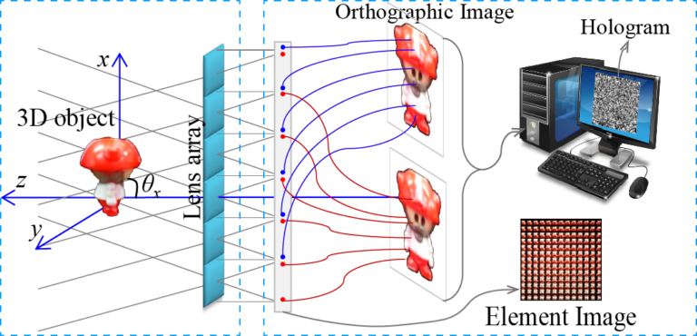
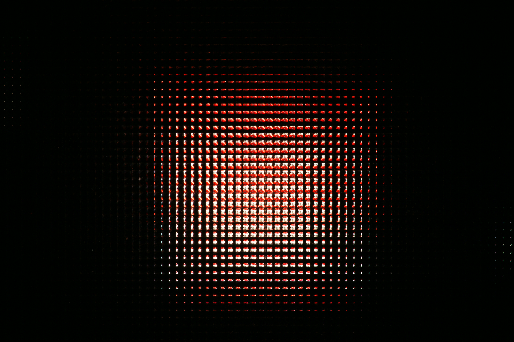
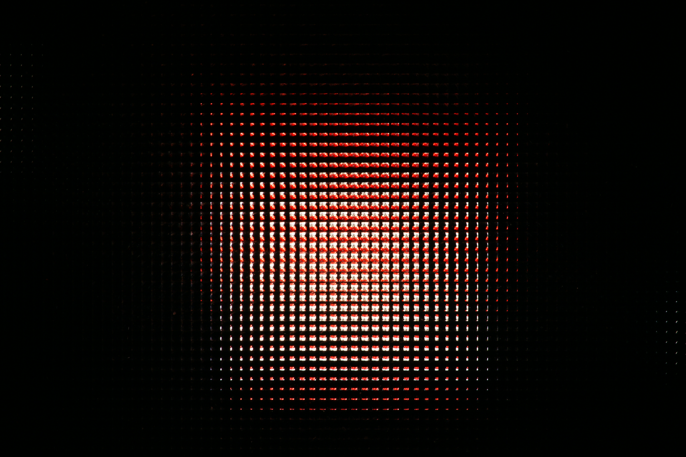
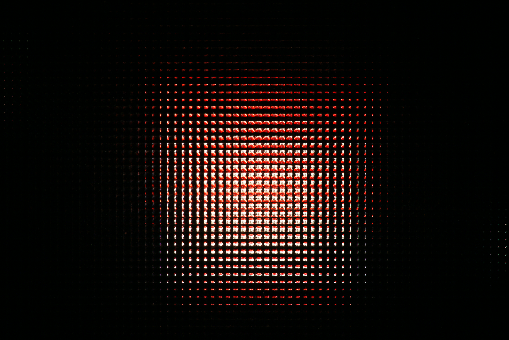
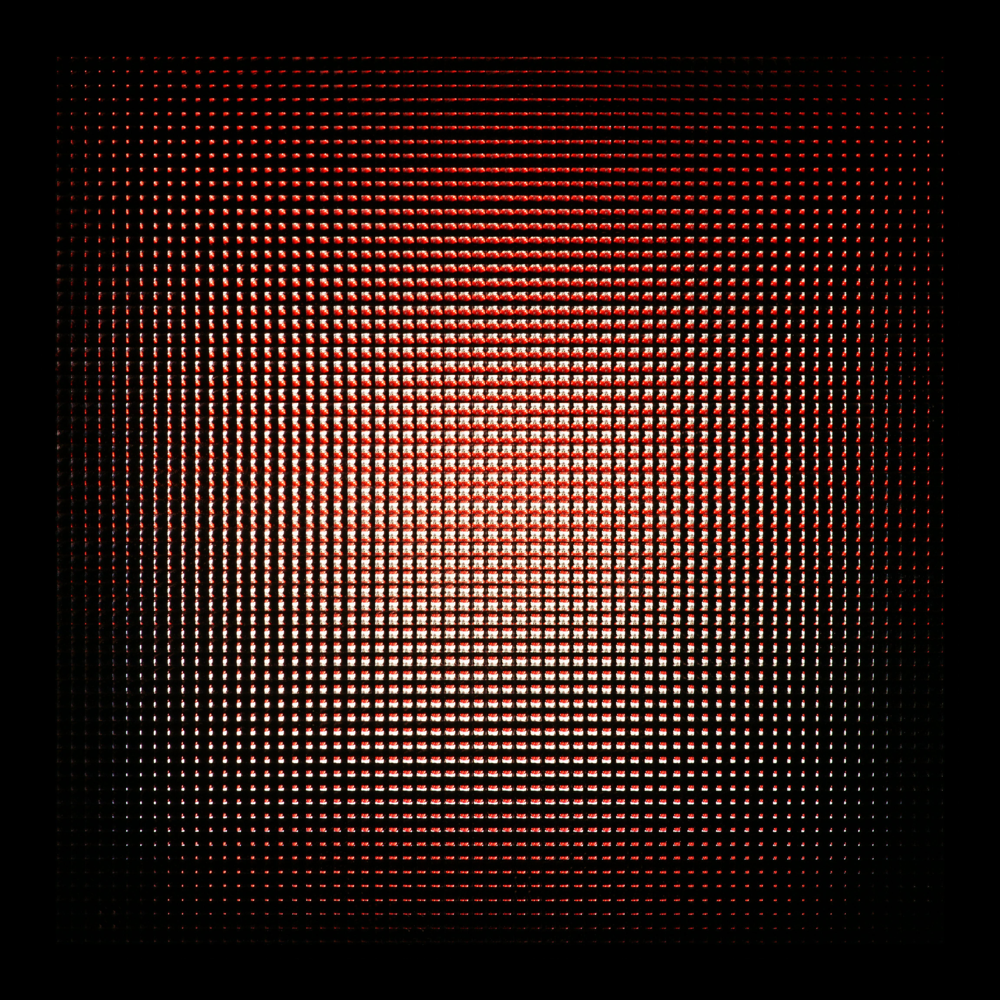

# Integral imaging based synthetic holography

|              |
| ------------------------------------------------------------ |
| Schematic of hologram synthesize from orthographic view images |

## Resolution enhancement

A set of captured elemental images

|  |  |
| ---------------------------------------: | :--------------------------------------- |
|  |  |

Synthezed elemental image
 -->

## References

- Min Wan, Inbarasan Muniraj, Ra’ed Malallah, Ni Chen, John J. Healy, James P. Ryle, and John T. Sheridan, “Orthographic projection images based photon counted integral Fourier holography”, Applied Optics, 58(10):2656-2661, Mar. 2019. 
- Ni Chen, Zhenbo Ren, and Edmund Y. Lam, “High resolution Fourier hologram synthesis from photographic images through computing the light field”, Applied Optics, 55(7):1751–1756, Mar. 2016. 
- Ni Chen, Jiwoon Yeom, Jae-Hyun Jung, Jae-Hyeung Park, and Byoungho Lee, “Resolution comparison between integral-imaging-based hologram synthesis methods using rectangular and hexagonal lens arrays”, Optics Express, 19(27):26917–26927, Dec. 2011.
- Ni Chen, Jae-Hyeung Park, and Nam Kim, “Parameter analysis of integral Fourier hologram and its resolution enhancement”, Optics Express, 18(3):2152–2167, Jan. 2010. 